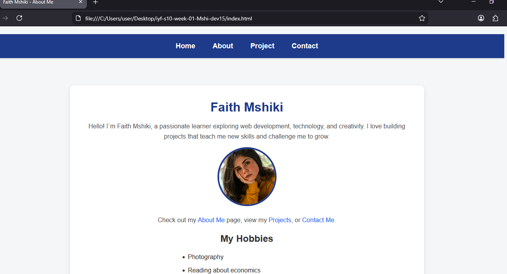

# Faith Mshiki - Week 03 Project

This is a responsive portfolio “awesome app” created for Git practice.  
I built navigation, about page, projects layout, and a contact page.  
I practiced CSS styling, responsive design, and Git/GitHub workflow.

## Live Demo

[View Live Site](https://mshi-dev15.github.io/iyf-s10-week-01-Mshi-dev15/)  <!-- Replace with GitHub Pages link if deployed -->

## Screenshot

  <!-- Replace with actual screenshot if you have one -->

## Features

- ✅ Responsive design
- ✅ Accessible (WCAG compliant)
- ✅ Multi-page layout
- ✅ Contact form

## Technologies Used

- HTML5
- CSS3 (Flexbox, Grid)
- Git & GitHub

## Project Structure

\`\`\`
iyf-s10-week-03-yourusername/
├── index.html
├── about.html
├── projects.html
├── contact.html
├── css/
│   └── styles.css
└── images/
\`\`\`

## What I Learned

- How to structure a multi-page portfolio
- Linking CSS and making pages responsive
- Using Git branches, merging, and GitHub workflow
- How to handle merge conflicts

## Future Improvements

- [ ] Add JavaScript interactivity
- [ ] Implement dark mode
- [ ] Add project filtering

## Contact

- Email: winnie2425walker@gmail.com
- LinkedIn: [Faith Mshiki](https://www.linkedin.com/in/faith-mshiki-b782b6221?utm_source=share&utm_campaign=share_via&utm_content=profile&utm_medium=android_app)
- GitHub: [@Mshi-dev15](https://github.com/Mshi-dev15)

## License

This project is open source and available under the [MIT License](LICENSE)